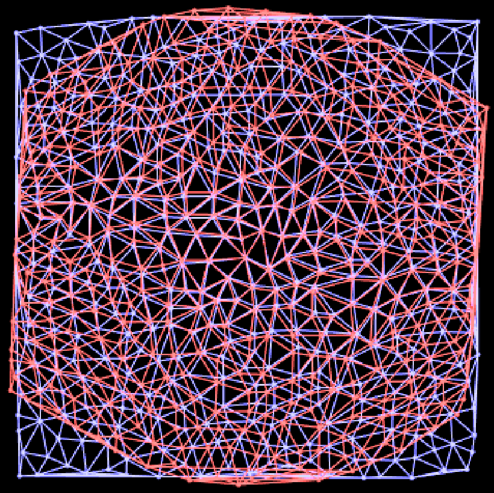
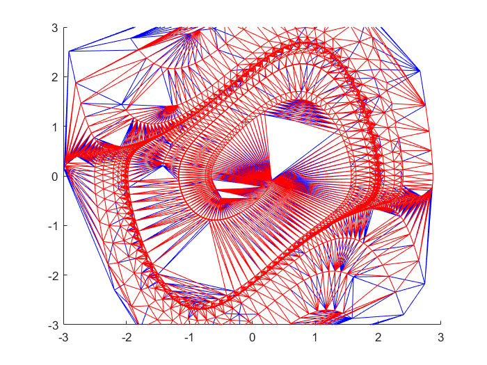

# Data-Integrated-Embedded-Control
Course Project for ESE 559 Data-Integrated Frameworks for Systems Analysis and Control Design

Current topics of interest:

### Efficient Triangulation

- Delaunay Triangulation is the standard, balanced triangulation algorithm
- Delaunay Triangulation can be calculated efficiently by projection on a convex hull
  - Ex. [qhull.org](http://www.geom.uiuc.edu/graphics/pix/Special_Topics/Computational_Geometry/delaunay.html)
- Interested in efficiently altering triangulations when adding points over time

Delaunay Triangulation Over Time | Voronoi Graph Over Time
:---:|:---:
 | 

### Implications of taking samples from continuous time signals

Van der Pol Uniformly Sampled | Van der Pol Sampled Over Time
:---:|:---:
 | 

### Clustering as a Nonlinearity Measure
- We can find simplex transformations (our method of linearizing the dynamics of a region between points)
- We can measure the similarity of these simplex transformations as a sort of non-linearity measure
  - [S. Zeng, Observability measures for nonlinear systems](https://github.com/donnellca/Data-Integrated-Embedded-Control/blob/main/Papers/C1.Observability%20measures%20for%20nonlinear%20systems.pdf)
- I also believe we can use simplex clustering to "cull" simplices in regions where the system is either very linear or has been oversampled

### Balancing the ideas of memory and computational efficiency
- Simplex clustering and culling saves memory and makes region lookup faster
- Preserving the full grid of simplices makes Delaunay Triangulation quick and efficient
- How to balance or incorporate these two techniques to make real-time/offline modeling and learning efficient
